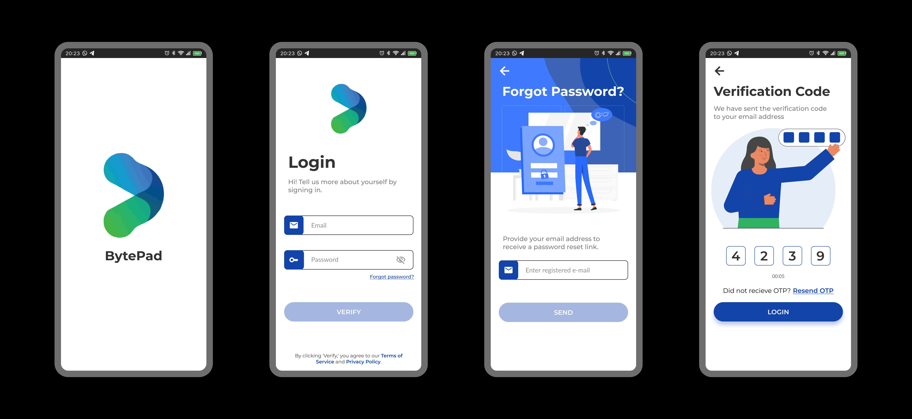
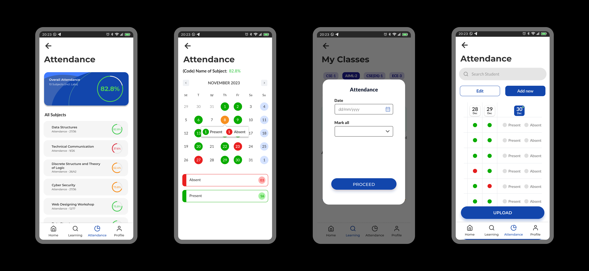
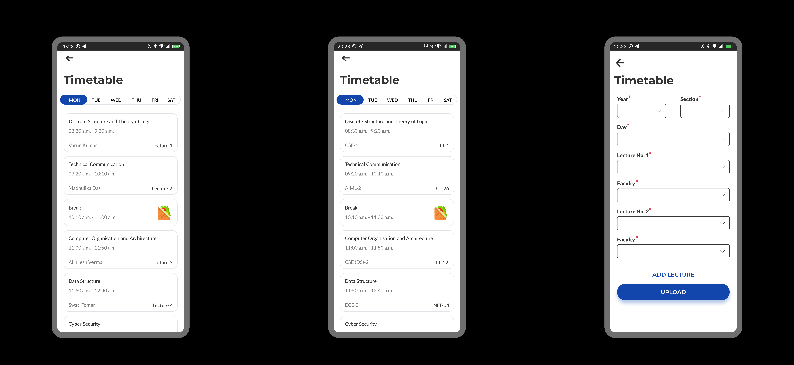
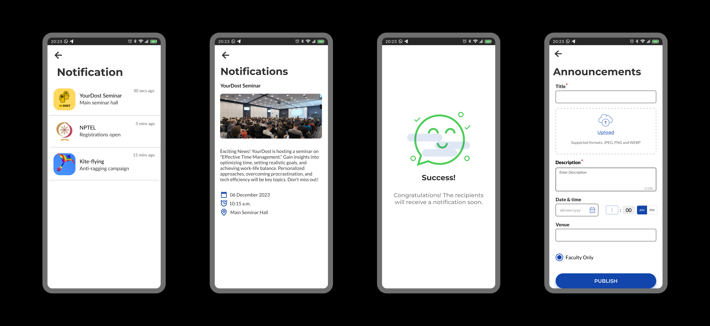
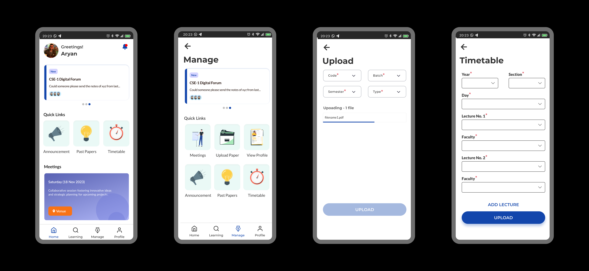

# BytePad - Student Management App

BytePad is a comprehensive student management app designed to streamline and enhance the academic experience for students, teachers, and Heads of Department (HOD). This app offers a range of functionalities to facilitate seamless communication, resource access, and organization. Whether you're a student, teacher, or HOD, BytePad has you covered. 🚀

## Screenshot



## Features

### 1. Past Papers and Solutions 📚

Access a repository of past papers and their solutions to help students prepare for exams effectively. Teachers can contribute to the repository, ensuring a comprehensive collection of study materials.


### 2. Attendance 📅

Keep track of attendance effortlessly. Students can view their attendance records, while teachers can easily mark and manage attendance for their classes.



### 3. Timetable ⌚

Stay organized with a dynamic timetable that adapts to your schedule. Students and teachers can view their timetables, helping them plan their activities efficiently.



### 4. Announcement 🔔

Receive important announcements from teachers or HOD directly through the app. Stay informed about class updates, schedule changes, and other essential information.



## User Roles

### 1. Students 👩🎓👨🎓

- View attendance records
- Access past papers and solutions
- View assignments
- View and manage timetable
- Get notified about events
- Receive announcements


### 2. Teachers 👩🏫👨🏫

- Mark and manage attendance
- Contribute to the past papers repository
- Upload solutions of past papers
- View and manage timetable


### 3. Heads of Department (HOD) 👩💼👨💼

- Monitor overall attendance trends
- Oversee and contribute to the past papers repository
- View and manage departmental timetable
- Broadcast important announcements to the department
- Create timetables



## Backend Contributor

[Yash Bansal](https://github.com/Yash114Bansal) - Contributed to the backend part of the app. You can find the backend repository at [BytePad](https://github.com/Yash114Bansal/BytePad).

## Running the App

To run the app, you need to have Flutter installed on your machine. If you don't have it installed, you can follow the instructions [here](https://flutter.dev/docs/get-started/install) to install it.

1. Clone the repository:

```CMD
git clone https://github.com/lakshya1goel/BytePad.git
```

2. Navigate to the project directory:

```CMD
cd BytePad
```

3. Install the dependencies:

```CMD
flutter pub get
```

4. Run the app on an emulator or connected device:

```CMD
flutter run
```


## Usage

1. **Installation:** Download and install BytePad Mobile Application.

2. **Account Creation:** Students, teachers, and HOD can login using their official credentials provided by the institution.

3. **Explore and Engage:** Explore the various features and start using BytePad to enhance your academic experience.

## Contributing

Contributions to Bytepad are welcome! If you encounter any issues or have suggestions for improvements, please feel free to open an issue or submit a pull request.
